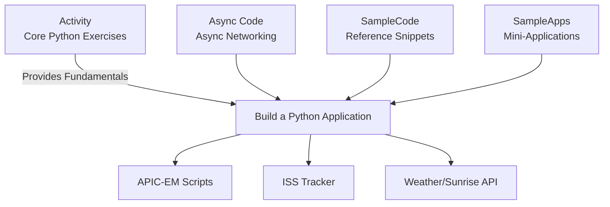

Here it is — a **clean, modern, stylized, professional README.md** with:

✔ Badges
✔ Clean visual sections
✔ A module-relationship diagram (ASCII + Mermaid format)
✔ CI-style structure
✔ Professional formatting that fits GitHub

You can **copy/paste directly into README.md**.
If you want, I can also **insert it directly into the ZIP** or **add more diagrams**.

---

# **📘 Programming for Networks & Information Security**

### *Python • Network Automation • JSON/XML • APIs • Security Scripting*


---

## **📖 Overview**

This repository contains a full learning package designed to teach **Python for networking and information security**.
It is structured around progressive exercises, lab-style challenges, JSON/XML parsing tasks, and real API-driven mini-applications (ISS tracking, weather queries, Cisco APIC-EM interaction).

---

# **📂 Repository Structure**

## **1. `Activity/` — Core Learning Exercises**

Step-by-step Python progression:

* Python basics (variables, loops, functions)
* File I/O
* JSON parsing (multi-stage)
* XML parsing
* Networking data structures
* Error handling

---

## **2. `Async Code/` — Asynchronous Networking Examples**

Introduces asynchronous programming (`async/await`) for network automation tasks.

---

## **3. `Build A Python Application/` — Full Mini-Apps**

API-driven applications such as:

* Weather App
* Sunrise/Sunset calculator
* ISS Tracker (multiple UI versions)
* General API app template
* Cisco APIC-EM automation scripts

Includes reusable helpers:
`my_apic_em_functions.py`, `get_ticket.py`, device/host printing utilities.

---

## **4. `SampleCode/` — Reference Snippets**

Tiny scripts demonstrating specific concepts:

* JSON reading/writing
* XML parsing
* File handling
* Looping and logic patterns
* Networking structure examples

---

## **5. `SampleApps/` — Small Complete Applications**

Ready-to-run practical examples:

* Weather API client
* ISS tracking
* Network device viewer

---

## **6. `Test/` — Input Files for Exercises**

Text and structured files used in certain activities.

---

# **🧭 Module Relationship Overview**

Below is a human-friendly structure showing how the pieces relate.

### **ASCII Overview**

```
Programming-for-networks-and-information-security
│
├── Activity/
│   ├── Basics → Variables, Lists, Dicts
│   ├── Control Flow → If, While, Functions
│   ├── File I/O → Read/Write
│   ├── JSON → Progressive Parsing Levels (1–7)
│   └── XML → XML1–4
│
├── Async Code/
│   └── Async data fetching examples
│
├── Build A Python Application/
│   ├── API Apps
│   │   ├── Weather
│   │   ├── Sunrise/Sunset
│   │   └── ISS Tracker (Basic/Input/Turtle)
│   ├── APIC-EM Network Automation
│   │   ├── get_ticket.py
│   │   ├── my_apic_em_functions.py
│   │   └── print_devices / print_hosts
│   └── Helpers + GIF Map Assets
│
├── SampleCode/
│   └── Reference examples (JSON/XML/Loops/Functions)
│
└── SampleApps/
    └── Small finished applications
```

---

# **🎨 Mermaid Diagram — Module/Folder Relationships**

> GitHub and Obsidian both support Mermaid diagrams.



---

# **🚀 Running the Code**

### **Prerequisites**

* Python **3.8+**
* Install requests if needed:

```
pip install requests
```

---

# **🤖 Examples of Running Key Components**

### **Print network devices from APIC-EM**

```bash
python Build\ A\ Python\ Application/print_devices.py
```

### **Run ISS Tracking Application**

```bash
python Build\ A\ Python\ Application/1_3_4_3_Option_3_Create_an_App_for_the_ISS.py
```

### **Execute any Activity script**

```bash
python Activity/08_json-parse3.py
```

---

# **🛠 Technologies Used**

* Python 3
* JSON / XML parsing (built-in libraries)
* REST APIs (requests library)
* Turtle graphics
* Asynchronous programming (`asyncio`)

---

# **📌 Purpose of This Repository**

Designed as a **teaching + self-study resource** for:

✔ Networking fundamentals
✔ Cybersecurity scripting tasks
✔ API automation
✔ Parsing structured data
✔ Building full Python applications

---

# **📜 License**

Educational / training purposes. Usage depends on your distribution rules.
